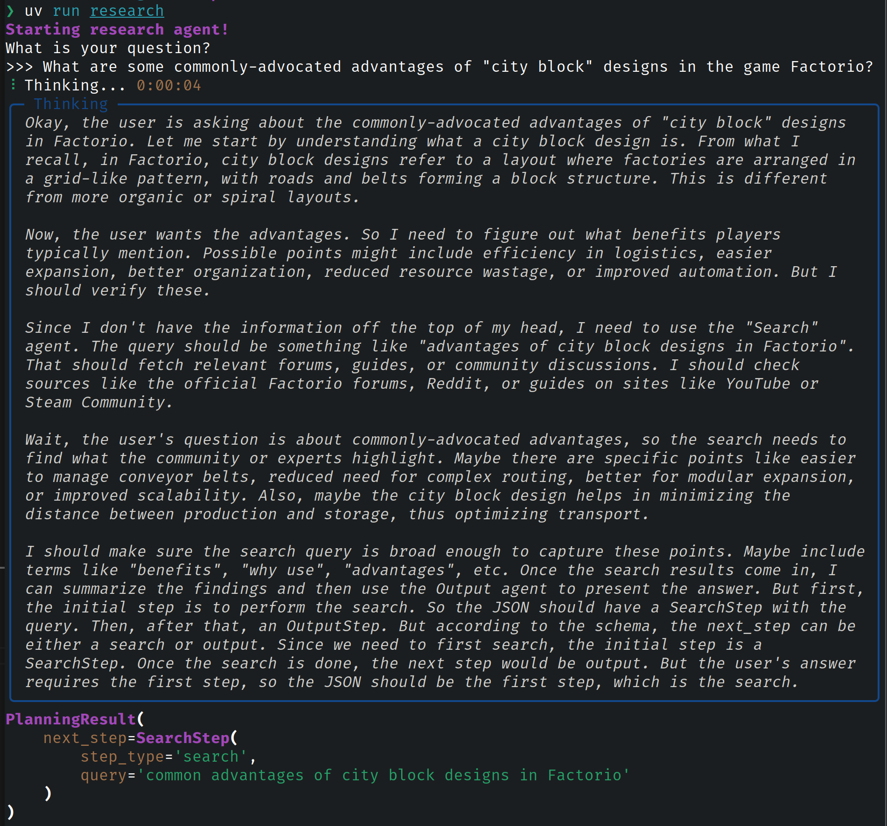
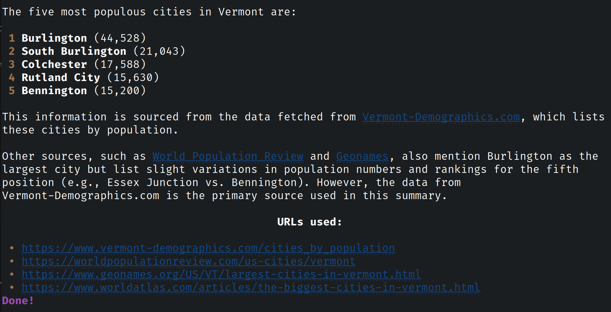

# `simple_research`: Experimental Research Agent

**WORK IN PROGRESS:** This repository is an attempt to mimic the various "Deep Research" tools from the big AI labs, but using Qwen 30B A3B. Think of this more as a benchmark and proof-of-concept than an actual useful tool. Hence "Simple Research". And the most useful thing you can probably do with this tool is use it to test out new models to see if they have the potential to be agents.

The current version can run simple searches and assemble reports, but it would benefit from more tweaking.



A lot of these initial hypotheses are wrong, because Qwen3 30B A3B doesn't actually understand Factorio. But that's why we want it to Google stuff, and use _that_ information to answer for the user.

Qwen3 is smart enought to _realize_ that it's guessing, and to decide to run a search. Which still impresses me in the first half of 2025.

## More examples

Sample research output about the largest cities in Vermont:



You can find [longer example traces in `examples/`](./examples/).

## System Requirements

You will get best results with an Nvidia card with 24GB of VRAM, though nothing prevents you from trying with a smaller card and off-loaded layers if you're patient.

## Configuring

Copy `.env.template` to `.env` and fill in the missing credentials.

## Running

You will need to [install Ollama](https://ollama.com/) and run:

```sh
ollama pull hf.co/unsloth/Qwen3-30B-A3B-GGUF:Q4_K_XL
```

You will also need to [install `uv`](https://docs.astral.sh/uv/getting-started/installation/). From there, you can run any of the following:

```sh
# Run type checker, tests, etc.
uv run poe check

# Run research agent. Ask it questions interactively!
uv run research
```

## How this differs from "frontier" agents

Qwen3 is pretty smart for a local model, and it knows how to use tools. But we cheat and help it out by using a few tricks:

- Instead of passing the full history around everywhere, and making the context too big for a GPU with 24GB of VRAM, we have a `Memory` type that remembers and summarizes the important history. This allows us to keep the context small, and in theory it helps keep the model from drifting.
- Instead of having the agent interact directly with the MCP servers, we wrap each tool in a Python class that provides a custom, tool-specific prompt. But the model still decides when to use which tools.
- We _always_ allow the model to `<think>...</think>`, even when the Chat Completions API and Ollama would otherwise prevent it from doing so.

The decision to approach the problem this way is based on messing around with Qwen3 and seeing what gets interesting results.

## Testing

I'm still figuring out a good strategy for thoroughly testing non-deteministic LLM agents that interact with MCP commands. Currently, our testing strategy is:

- Stub MCP commands to return known output.
- Pass very clear test data to the LLM.
- Retry failed test cases once using a `pytest` plugin.

A more advanced system might run each test 10 times and insist on 9 passes, or something like that. We could also try to force the LLM to be deterministic, but that can allegedly be difficult even if a `seed` parameter is available, due to differences in hardware and library versions. Better to embrace randomness.